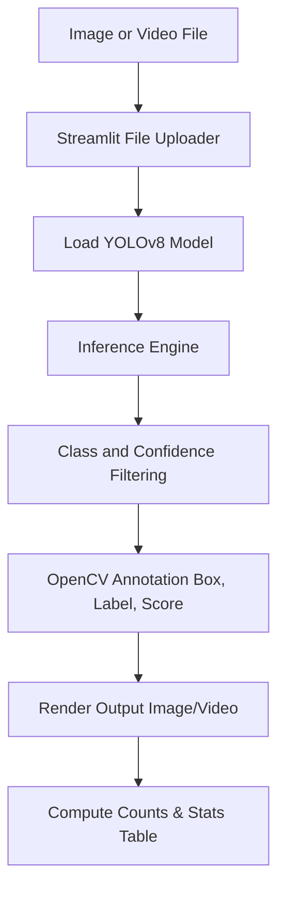

# Project Report: Real-Time Object Detection Dashboard

---

## 1. Project Overview & Abstract

In computer vision, **Object Detection** is the fundamental task of locating and classifying instances of visual objects in images or video frames. Unlike simple image classification, object detection outlines the boundaries of each object with a bounding box and assigns a confidence score for its category.

This project implements a web-based **Real-Time Object Detection Dashboard** that utilizes **YOLOv8** (an advanced single-stage deep learning model) for object detection, and **OpenCV** for image processing and visual annotations. The dashboard allows users to upload static images or video files, customize confidence thresholds, filter target classes, and view real-time statistics, including total object counts and class-wise distributions. Built with a premium glassmorphic theme, it is optimized for high responsiveness and easy demonstrations.

---

## 2. System Architecture & Processing Pipeline

The application processes inputs through a modular, reactive data pipeline:

### Key Components:
1. **Model Loader (YOLOv8)**: We load the pre-trained `yolov8n.pt` (Nano) model, which is optimized for fast execution on standard CPU hardware without sacrificing localization accuracy.
2. **Inference & Filter Engine**: The model analyzes each frame and extracts bounding boxes, classes, and confidence scores. Users can dynamically filter by confidence threshold or COCO class selections via the sidebar.
3. **Annotation Engine (OpenCV)**: Custom bounding boxes are drawn on the frames using class-specific colors. Class labels and confidence scores are overlaid as text blocks.
4. **Analytics Dashboard**: Streamlit calculates the count of objects per class and displays them in a clean table along with inference speeds (for images) or processing FPS (for videos).

---

## 3. GitHub Repository Description

**Repository Title**: `realtime-object-detection-yolov8-streamlit`

**Description**:
> 👁️ An interactive, production-ready Object Detection dashboard built with Python, Streamlit, OpenCV, and YOLOv8. Supports image and video file uploads, adjustable confidence thresholds, target class filtering, real-time object counting, and processed video exports. Designed with a premium custom dark UI.

---

## 4. LinkedIn Project Description

**Title**: Created an Interactive Object Detection Dashboard with YOLOv8 & Streamlit

**Post Description**:
> 🚀 I am excited to share the completion of my third internship project as an AI Intern at CodeAlpha: a **Real-Time Object Detection Dashboard**! 👁️
> 
> Building smart visual pipelines is critical for automation, safety, and surveillance. I designed a dashboard that lets users analyze images and videos using advanced deep learning.
> 
> **Key Features**:
> 🧠 **YOLOv8 Inference**: Runs high-speed object localization and classification using YOLOv8.
> 📁 **Multi-Source Uploads**: Seamlessly processes both static images and video files.
> 📊 **Live Analytics**: Computes real-time object counts, class breakdown statistics, and inference speeds.
> ⚙️ **Interactive Filters**: Features adjustable confidence thresholds and COCO class filters to focus on relevant objects.
> 📥 **Video Export**: Processes uploaded videos frame-by-frame and exports the annotated MP4 result.
> 
> Check out the GitHub repository below to run it locally or try it out!
> 
> #Python #ComputerVision #DeepLearning #YOLOv8 #AI #Streamlit #MachineLearning #CodeAlpha
> 
---

## 5. Resume Bullet Points

* **AI Intern | CodeAlpha**
  * Engineered a production-ready Object Detection web application in Python, Streamlit, and OpenCV, utilizing YOLOv8 for sub-second visual inference on images and videos.
  * Created dynamic class filtering and confidence thresholding pipelines, allowing users to isolate and count target objects in real time.
  * Designed a premium glassmorphic dashboard showcasing processing speed, object counts, and class breakdowns, along with automated video export capabilities.

---

## 6. Viva Questions and Answers

### Q1: Why did you choose YOLOv8 over older YOLO versions or SSD/R-CNN?
**A**: YOLOv8 is a state-of-the-art model from Ultralytics that balances accuracy and computational speed. Unlike R-CNN which is a two-stage detector (slow), YOLOv8 is a single-stage detector that predicts bounding boxes and class probabilities in a single pass. It is much faster and offers better optimization out-of-the-box compared to SSD or older YOLO versions.

### Q2: What is the purpose of the Non-Maximum Suppression (NMS) in YOLO?
**A**: During detection, a model might predict multiple overlapping bounding boxes for the same object. Non-Maximum Suppression (NMS) filters these duplicates by keeping only the box with the highest confidence and discarding other overlapping boxes that have an Intersection-over-Union (IoU) greater than a specified threshold.

### Q3: Why did you choose the YOLOv8 Nano (`yolov8n.pt`) model variant?
**A**: YOLOv8 has several model variants ranging from Nano (smallest) to Extra Large (largest). We choose the Nano variant because it has only 3.2 million parameters. This makes it extremely lightweight (approx. 6MB file size) and fast, which is ideal for real-time CPU processing in a local or cloud-hosted Streamlit app without requiring a dedicated GPU.

### Q4: How is the object counting logic implemented?
**A**: In `app.py`, as we iterate through the YOLOv8 detection results, we retrieve the class name of each box. We store these names in a dictionary where the keys are the class names and the values are their occurrence counts. For videos, we track the maximum count of each class observed in a single frame to represent the peak load.

### Q5: How do you handle file path operations for video processing in Streamlit?
**A**: Streamlit uploads files as in-memory streams or temporary files. Since OpenCV's `cv2.VideoCapture` requires a physical file path to parse video frames, we write the uploaded video bytes into a temporary file using Python's `tempfile` module. This file path is passed to OpenCV, and once the processing completes, the temporary files are cleaned up to prevent disk clutter.
